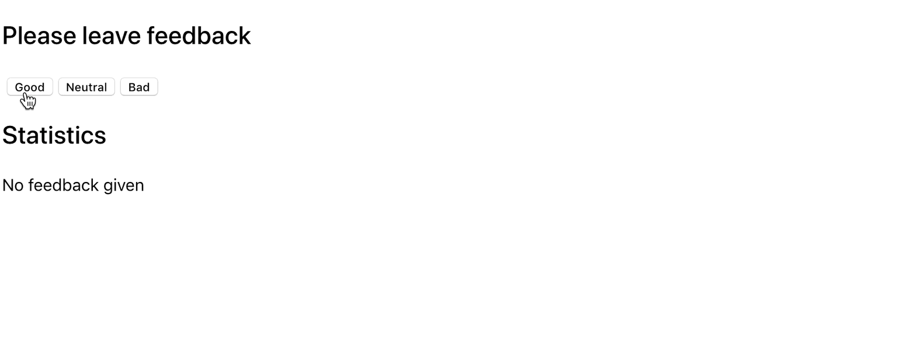

# goit-react-hw-02-feedback

GoIT course React homework

# Критерии приема

- Создана репозитория `goit-react-hw-02-feedback`.
- При сдаче домашней работы есть две ссылки: на исходные файлы и рабочие.
  страницы каждого задания на `GitHub pages`.
- При запуске кода задания, в консоли нету ошибок и предупреждений.
- Для каждого компонента есть отдельный файл в папке `src/components`.
- Для компонентов описаны `propTypes`, и где необходимо, `defaultProps`.
- Все что компонент ожидает в виде пропсов, передается ему при вызове.
- JS-код чистый и понятный, используется `Prettier`.
- Стилизация делается только `SASS`, `CSS-модулями` или `Styled Components`.
  Выделяй 20% времени на стилизацию и 80% на JS.

## Заданиe

# Виджет отзывов

Как и большинство компаний, кафе Expresso собирает отзывы от своих клиентов.
Твоя задача - создать приложение для сбора статистики. Есть всего три варианта
обратной связи: хорошо, нейтрально и плохо.

## Шаг 1

Приложение должно отображать количество собранных отзывов для каждой категории.
Приложение не должно сохранять статистику отзывов между разными сессиями
(обновление страницы).

Состояние приложения обязательно должно быть следующего вида, добавлять новые
свойства нельзя.

```bash
state = {
  good: 0,
  neutral: 0,
  bad: 0
}
```

Интерфейс может выглядеть так.


## Шаг 2

Расширь функционал приложения так, чтобы в интерфейсе отображалось больше
статистики о собранных отзывах. Добавь отображение общего количества собранных
отзывов из всех категорий и процент положительных отзывов. Для этого создай
вспомогательные методы `countTotalFeedback()` и
`countPositiveFeedbackPercentage()`, подсчитывающие эти значения основываясь на
данных в состоянии (вычисляемые данные).


## Шаг 3

Выполни рефакторинг приложения. Состояние приложения должно оставаться в
корневом компоненте `<App>`.

- Вынеси отображение статистики в отдельный компонент
  `<Statistics good={} neutral={} bad={} total={} positivePercentage={}>`.
- Вынеси блок кнопок в компонент
  `<FeedbackOptions options={} onLeaveFeedback={}>`.
- Создай компонент `<Section title="">`, который рендерит секцию с заголовком и
  детей (children). Оберни каждый из `<Statistics>` и `<FeedbackOptions>` в
  созданный компонент секции.

## Шаг 4

Расширь функционал приложения так, чтобы блок статистики рендерился только после
того, как был собран хотя бы один отзыв. Сообщение об отсутствиии статистики
вынеси в компонент `<Notification message="No feedback given">`.



# Getting Started with Create React App

This project was bootstrapped with
[Create React App](https://github.com/facebook/create-react-app).

## Available Scripts

In the project directory, you can run:

### `npm start`

Runs the app in the development mode.\
Open [http://localhost:3000](http://localhost:3000) to view it in the browser.

The page will reload if you make edits.\
You will also see any lint errors in the console.

### `npm test`

Launches the test runner in the interactive watch mode.\
See the section about [running tests](https://facebook.github.io/create-react-app/docs/running-tests)
for more information.

### `npm run build`

Builds the app for production to the `build` folder.\
It correctly bundles React in production mode and optimizes the build for the best
performance.

The build is minified and the filenames include the hashes.\
Your app is ready to be deployed!

See the section about
[deployment](https://facebook.github.io/create-react-app/docs/deployment) for
more information.

### `npm run eject`

**Note: this is a one-way operation. Once you `eject`, you can’t go back!**

If you aren’t satisfied with the build tool and configuration choices, you can
`eject` at any time. This command will remove the single build dependency from
your project.

Instead, it will copy all the configuration files and the transitive
dependencies (webpack, Babel, ESLint, etc) right into your project so you have
full control over them. All of the commands except `eject` will still work, but
they will point to the copied scripts so you can tweak them. At this point
you’re on your own.

You don’t have to ever use `eject`. The curated feature set is suitable for
small and middle deployments, and you shouldn’t feel obligated to use this
feature. However we understand that this tool wouldn’t be useful if you couldn’t
customize it when you are ready for it.

## Learn More

You can learn more in the
[Create React App documentation](https://facebook.github.io/create-react-app/docs/getting-started).

To learn React, check out the [React documentation](https://reactjs.org/).

### Code Splitting

This section has moved here:
[https://facebook.github.io/create-react-app/docs/code-splitting](https://facebook.github.io/create-react-app/docs/code-splitting)

### Analyzing the Bundle Size

This section has moved here:
[https://facebook.github.io/create-react-app/docs/analyzing-the-bundle-size](https://facebook.github.io/create-react-app/docs/analyzing-the-bundle-size)

### Making a Progressive Web App

This section has moved here:
[https://facebook.github.io/create-react-app/docs/making-a-progressive-web-app](https://facebook.github.io/create-react-app/docs/making-a-progressive-web-app)

### Advanced Configuration

This section has moved here:
[https://facebook.github.io/create-react-app/docs/advanced-configuration](https://facebook.github.io/create-react-app/docs/advanced-configuration)

### Deployment

This section has moved here:
[https://facebook.github.io/create-react-app/docs/deployment](https://facebook.github.io/create-react-app/docs/deployment)

### `npm run build` fails to minify

This section has moved here:
[https://facebook.github.io/create-react-app/docs/troubleshooting#npm-run-build-fails-to-minify](https://facebook.github.io/create-react-app/docs/troubleshooting#npm-run-build-fails-to-minify)
